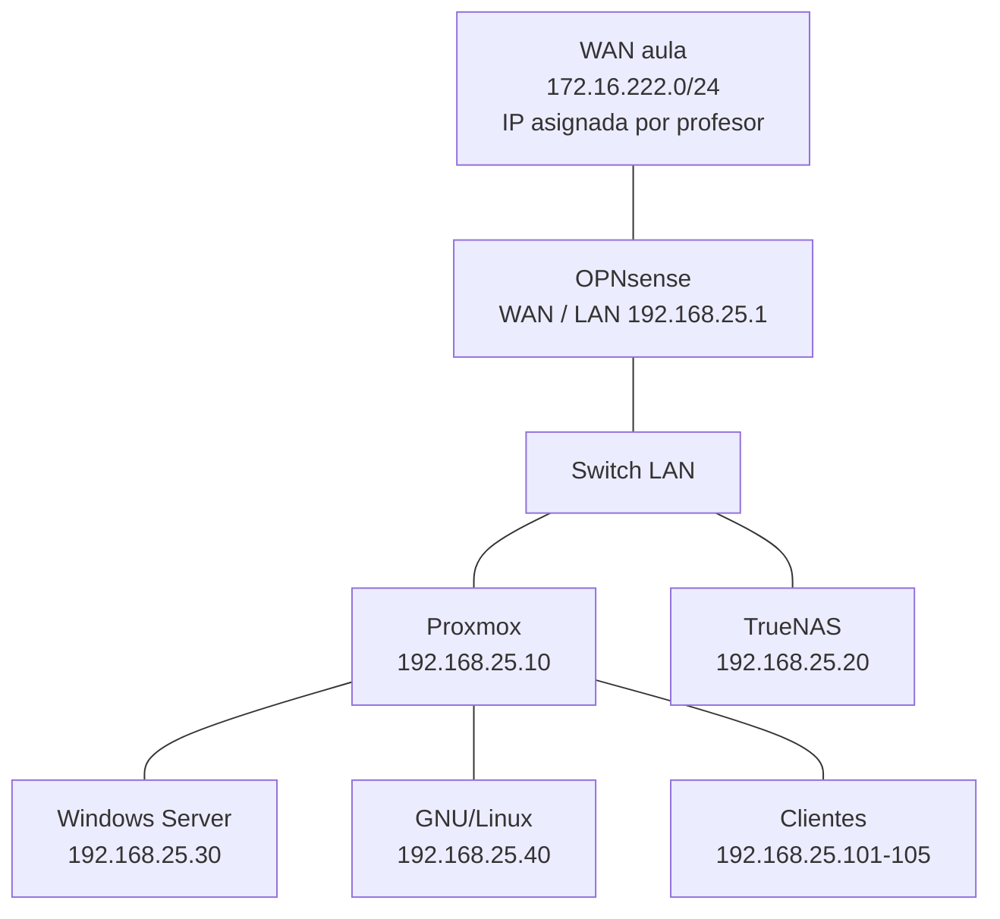

# Diagrama lógico

```mermaid
flowchart TB
  WAN["WAN aula<br/>172.16.222.0/24<br/>IP asignada por profesor"]
  FW["OPNsense<br/>WAN / LAN 192.168.25.1"]
  SW["Switch LAN"]
  PVE["Proxmox<br/>192.168.25.10"]
  NAS["TrueNAS<br/>192.168.25.20"]
  DC["Windows Server<br/>192.168.25.30"]
  LNX["GNU/Linux<br/>192.168.25.40"]
  PC["Clientes<br/>192.168.25.101-105"]
  WAN --- FW
  FW --- SW
  SW --- PVE
  SW --- NAS
  PVE --- DC
  PVE --- LNX
  PVE --- PC
```

Actualizar este esquema para que represente exactamente las conexiones físicas y virtuales del laboratorio.
